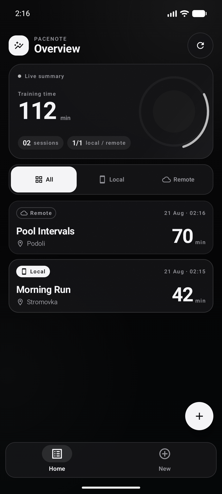

# pacenote

pacenote is a production-like android demonstration app for recording sports results. a result has a name, location, duration, and an explicit storage destination. local records persist in room; remote records use a credential-free in-memory backend behind a replaceable interface.

the project intentionally favors a reliable first run over a backend that requires a recruiter's firebase account, downloaded credentials, or secret configuration.

## screenshot

<p align="center">
  
</p>

## assignment coverage

| requirement | implementation |
| --- | --- |
| two screens | `home` (overview) and `new` are the only top-level destinations |
| name, location, duration | validated compose fields; whitespace is normalized and duration accepts 1–1440 minutes |
| local / remote choice | accessible selectable storage cards with a clear default (`local`) |
| local storage | room database, dao flow, schema export, repository abstraction |
| remote storage | working `InMemoryRemoteResultDataSource` with simulated latency; no credentials needed |
| all / local / remote filter | viewmodel-backed spring-animated segmented control and reactive result subsets |
| visually distinct sources | solid phone/`local` badge versus outlined cloud/`remote` badge |
| portrait and landscape | bottom navigation and a vertical composition on compact widths; slim workspace chrome and purpose-built two-pane layouts on expanded widths |
| consistent architecture | unidirectional ui state, viewmodels, use cases, repository, source interfaces, hilt |
| quality states | loading, refresh, empty, filtered-empty, save error, load error, retry, and success snackbar |

## design direction

the interface is a native compose interpretation of the **výpisflow product workspace** rather than a stock material color swap. it reuses the source project's visual logic: a `#09090B` canvas, zinc-toned surfaces and borders, a quiet 48 dp technical grid, compact controls, dense information hierarchy, short reactions, and a subtle high-frequency grain. the result is deliberately monochrome and product-like, without decorative gradients, glowing rings, cursive display faces, or oversized mobile ui.

typography uses a bundled inter variable font throughout the application, including the wordmark. the original font license is kept at `third_party/inter/LICENSE.txt`, so rendering is deterministic on every device and does not depend on a network font provider. a black circular `pn` mark with gray lettering replaces decorative sports iconography. storage meaning combines surface treatment, icon, and label: local is solid; remote is outlined.

every content card has a subtle deterministic noise layer adapted from the high-frequency fractal-noise treatment used by výpisflow. the native compose version is generated in `drawWithCache`, sits behind content, needs no bitmap asset, and avoids per-frame allocation. the 48 dp background grid and the noise are static, keeping text crisp and battery cost predictable.

the results screen keeps total training time, session count, and storage split glanceable in a static, text-led summary with no ornamental chart, ring, or ambient sheen. landscape is a separate workspace composition: a slim full-width top bar, a stable summary/filter pane, and an adaptive results grid that uses the remaining width. the creation screen also changes structure in landscape, placing location and duration side by side so destination selection, preview, and save action fit without an initial scroll. animated value swaps, staggered card entry, spring press states, and short spatial navigation transitions provide feedback without turning the screen into a screensaver. compose retains the system motion duration scale, so disabling android animations immediately resolves effects to their final state.

the authored tokens and adaptive component rules live in `design-system/pacenote/MASTER.md` and the compose `presentation/theme` package.

## navigation flow

the app opens on **home** (the results overview). that is the most useful returning-user destination and lets a reviewer understand the data model immediately. a compact `add result` action and the top-level `new` destination both open the form.

after a successful save, the app returns home and confirms the chosen destination in a snackbar. the new result is already present because both room and the remote demo expose observable flows. a failed save stays on the form, preserves the entered values, and offers a safe retry.

on compact devices the two destinations use a bottom navigation bar. at 600 dp and above it becomes slim edge-to-edge workspace chrome, freeing the full width for content rather than reserving a permanent rail. at 700 dp, each screen switches to its own two-pane composition. system back from the form returns to results naturally; successful saves do not build duplicate back-stack entries.

## architecture

```text
Compose screen
    ↓ events                 ↑ immutable StateFlow
ViewModel
    ↓
use case
    ↓
SportsResultRepository
    ├── LocalResultDataSource  → Room DAO → SQLite
    └── RemoteResultDataSource → in-memory demo backend
```

the project uses one app module because the assignment is intentionally small. package boundaries still express the layers without paying the build-time and navigation overhead of premature gradle modules.

```text
app/src/main/java/com/alexander/pacenote/
├── data/
│   ├── local/          Room entity, DAO, database, local adapter
│   ├── remote/         credential-free remote implementation
│   ├── repository/     source coordination and merge ordering
│   └── source/         local/remote contracts
├── di/                 Hilt bindings and providers
├── domain/
│   ├── model/          storage-aware domain models
│   ├── repository/     repository contract
│   ├── usecase/        save and filtered observation
│   ├── util/           injectable ID and time providers
│   └── validation/     pure form validation
└── presentation/
    ├── create/         form state, ViewModel, adaptive screen
    ├── results/        filter/list state, ViewModel, adaptive screen
    ├── navigation/     responsive navigation flow
    ├── preview/        portrait and landscape Android Studio previews
    └── theme/          Material 3 design tokens
```

### state and error handling

- `CreateResultViewModel` owns form state, validates before launching work, prevents duplicate submissions, retains input on failure, and emits one-shot success events separately from state.
- `ResultsViewModel` owns filtering, collection/loading errors, refresh state, and retries. filters re-subscribe through a use case so ui composables contain no data policy.
- `DefaultSportsResultRepository` creates ids/timestamps once, writes to exactly one destination, then combines and deterministically sorts both observable sources.

the visual source distinction deliberately uses color **plus** icon and text, so it remains understandable for users who cannot reliably distinguish the accent colors.

## remote trade-off and firebase path

the included remote implementation behaves like a small backend for the lifetime of the application process. it is a singleton, supports observable updates, upserts by id, sorts newest first, and simulates 350 ms network latency. its records intentionally disappear after a process restart. that limitation is visible in the ui copy rather than hidden.

to replace it with firestore:

1. implement `RemoteResultDataSource` in `data/remote`, mapping firestore snapshots to `SportsResult` and mapping writes to documents.
2. change only `provideRemoteDataSource()` in `di/AppModule.kt` to return the firestore adapter.
3. add the firebase gradle plugin/dependency and a local `google-services.json` as described by the firebase setup guide; do not commit credentials.
4. preserve the interface contract: observable results, suspending save, and explicit refresh.

no presentation, use-case, room, or repository api needs to change. a real backend would additionally need authentication, server timestamps, conflict policy, pagination, offline policy, and security rules. those concerns are deliberately not faked in a test assignment.

## run

prerequisites:

- android studio with jdk 17 or newer; the project is verified with azul zulu 21 lts (arm64)
- android sdk 36
- an emulator or device running android 8.0 / api 26 or newer

the reproducible build stack is agp 9.0.1, gradle 9.1.0, kotlin 2.3.20 with agp built-in kotlin, ksp 2.3.10, and hilt 2.59.2. in android studio, set **gradle jdk** to the same jdk as `JAVA_HOME`; on the verified development machine both point to azul zulu 21. open the repository root, let gradle sync, select the `app` configuration, and run it. no api keys, font downloads, or environment variables are required.

for production publishing, create a `keystore.properties` file from the example:

```bash
cp keystore.properties.example keystore.properties
```

fill in the keystore path and credentials, then build with:

```bash
./gradlew :app:koverVerifyDebug lintDebug assembleDebug assembleRelease
```

if no production keystore is configured, the release build falls back to the debug signing config so local verification still works. the debug apk is produced at `app/build/outputs/apk/debug/app-debug.apk`; the minified signed release apk is produced at `app/build/outputs/apk/release/app-release.apk` when a valid release keystore is supplied.

## tests and review aids

- 51 local unit tests cover normalization, boundary validation, mapping, room and remote adapters, repository merging and ordering, use cases, viewmodel state, errors, retries, concurrency, and duplicate-action protection.
- the kover gate requires 100% line coverage for every included deterministic logic class and 100% aggregate branch coverage. generated hilt code and compose/framework bytecode are outside that gate; kover does not collect instrumented on-device coverage.
- 34 api 36 device tests cover the two screens, callbacks, loading/error/empty/data states, theme and noise rendering, real in-memory room queries, provider wiring, application launch, navigation, validation, and a complete local-save flow.
- coverage reports are written to `app/build/reports/kover/htmlDebug` and `app/build/reports/kover/reportDebug.xml`.
- four android studio previews cover both screens in portrait and landscape. open `ScreenPreviews.kt` and use split or design view.
- ci enforces the logic coverage gate, android lint, and a debug apk build on every push and pull request.

local logic coverage:

```bash
./gradlew :app:koverVerifyDebug :app:koverHtmlReportDebug :app:koverXmlReportDebug
```

instrumented tests require a running device:

```bash
./gradlew connectedDebugAndroidTest
```

## deliberately optional next steps

- firestore implementation and its authentication/security rules
- paging once backend history becomes large
- edit/delete and result details
- end-to-end screenshot regression tests on a managed device
- localization beyond the current english resource set

these are extension points rather than unfinished assignment requirements.
